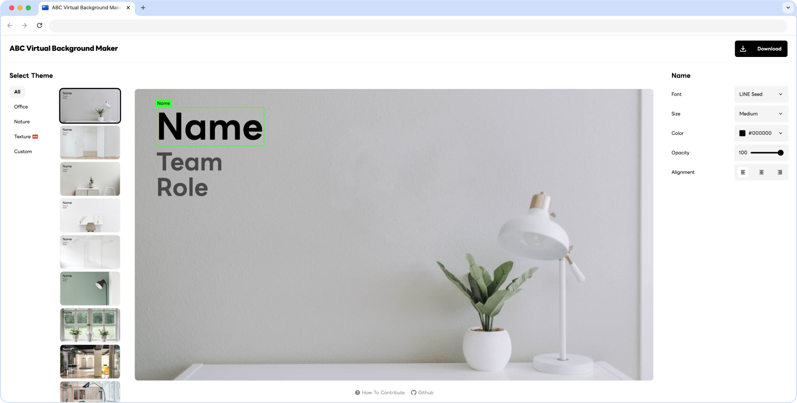
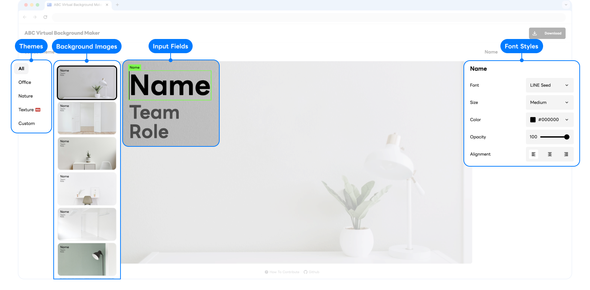

# ABC Virtual Background Maker

A standalone frontend app to generate and download zoom background image with text.



## ✨ Why we created ABC Virtual Background Maker

We recognized the need for a tool that allows teams to personalize their virtual backgrounds with ease, enhancing their professional image and brand identity.

If you've ever found yourself squinting at the screen during a video call, trying to match names to faces as your team grows, or wishing you could make it super easy for partners to spot your name and company, then this app's got your back.

And let's say your company is all about that unified look and drops official backgrounds to keep everyone's vibe on brand – you're going to love this.

## 💡 Features

1. Customizable Text Overlay - Conveniently add your name, company name, or any other information for Zoom or Teams calls.
2. Adjustable Fonts and Text Placement - Customize fonts and textfield position according to your preferences.
3. Organizable Themes - Create collections of background images, similar to folders, allowing for easy management of virtual backgrounds.
4. Image Storage Option - Manage your background images on GitHub repo, or load them from local directory.
5. Mirror Image Option - Download a reversed version of the image to accommodate video feeds that flip your background horizontally.
6. Image Upload Capability - Beyond using the preloaded backgrounds, users can also upload their own picture to create personalized virtual backgrounds.
7. Custom Brand Colors - Select a key color to align UI with your organization's other sites.
8. No Fuss App - It's a straightforward React web app that doesn't mess around with backend stuff.

## Getting Started

### 🛠️ How to Build

- We recommend using Node.js Version 18+ and `pnpm` [https://pnpm.io/installation](https://pnpm.io/installation)
- Build path: `dist`
- Build Command

  ```bash
  pnpm install && pnpm run build
  ```

### 💻 Local Development

1. In the repo folder

   ```bash
   pnpm install
   pnpm run dev
   ```

2. Dev server will be running at

   ```bash
   http://localhost:5173/
   ```

### 🐙 Github Pages Deployment

You can deploy directly from your GitHub repository using [GitHub Pages](https://pages.github.com/) at `Setting > Pages > Github Actions` menu.
Check our deployment workflow with [GitHub Actions](https://docs.github.com/en/actions) at [.github/workflows/deploy.yml](https://github.com/line/abc-virtual-background-maker/blob/main/.github/workflows/deploy.yml)

### 🐳 Container Deployment

We offer a [Dockerfile](Dockerfile) to help you get started quickly. You can execute the Docker commands as follows. It will allow you to access via 8080 port.

```dockerfile
docker build -t abc-virtual-background-maker .
docker run -d -p 8080:80 abc-virtual-background-maker
```

## 🧞‍♂️ How To Customize

Modify `app.config.json` files.



### 📷 Backgrounds Uri

You can choose where to load background images from. Currently, we are supporting filesystem, CDN, and GitHub repo. Below json examples shows how to set `backgroundsUri` value.

- with local images

```json
  "backgroundsUri": {
    "type": "filesystem",
    "path": "./backgrounds"
  }
```

- with CDN images

```json
  "backgroundsUri": {
    "type": "cdn",
    "path": "https://your-cdn-host/backgrounds"
  }
```

- with GitHub repository

You can manage background images using a GitHub repository. Create a GitHub repository and suppose that you have a repository with the following structure:

```
your-repo-name
├── backgrounds
│   ├── (app.config.json) // Optional. Without this configuration file, themes and background images are sorted alphabetically.
│   ├── your-theme-name
│   │   ├── 01.jpg
│   │   ├── 02.jpg
```

Rename `.env.example` file to `.env` (which will be ignored by Git), and set generated [Personal Access Token](https://docs.github.com/en/authentication/keeping-your-account-and-data-secure/managing-your-personal-access-tokens) value.

The `app.config.json` should be as below;

```json
  "backgroundsUri": {
    "type": "github",
    "path": "https://{your-git-host}/api/v3/repos/{your-repo-owner}/{your-repo-name}/contents/backgrounds"
  }
```

### 🗂️ Themes

1. Add new object value in `app.config.json` 's `themes`. (Value Type `src/constants/theme.ts`)
2. Set theme name value in new object. (**The theme name should match with the backgrounds subdirectory name.**)

| `Theme`                |                                                                | default |
| ---------------------- | -------------------------------------------------------------- | ------- |
| name                   | Theme name should be unique.                                   |         |
| backgrounds            | Array of images. (Detailed explanation about `Image` is below) |         |
| inputFields (optional) | Set up an input field group just for this theme                |         |
| isNew (optional)       | If it's true, new icon shows up next to this theme             | `false` |

### 🌆 Background Images

- with local images

1. Prepare 16:9 ratio images
2. Set image file name with rgb color with comma `rrr,ggg,bbb` between two dots, only if you need to set text color. (ex. 01.255,255,255.jpg)
3. Add background image files into `public/backgrounds/**/*`. (or any other directory and set `backgroundsUri` as relative path.)
4. `pnpm run build` or `pnpm run dev`
5. `app.config.json` 's `themes`'s `backgrounds` value will be changed automatically.

- with CDN images

1. Prepare 16:9 ratio images urls
2. Set `backgroundsUri` in `app.config.json` as base url.
3. Add `themes`'s `backgrounds` values as an object in `app.config.json`.

| `Image`              |                                                  | default |
| -------------------- | ------------------------------------------------ | ------- |
| src                  | contains the path to the image you want to embed |         |
| fontColor (optional) | Font color in this image                         |         |
| theme (optional)     | Which theme does it belong to                    |         |

### 📝 Input Fields

- Modify default input fields: Change `defaultInputFields`'s value in `app.config.json` (Value Type `src/constants/input.ts`)

  | `InputFieldGroup`    |                                                                                                                | default            |
  | -------------------- | -------------------------------------------------------------------------------------------------------------- | ------------------ |
  | position             | InputFieldGroup position within the image divided by 3x3 sections. (row-column)                                |                    |
  | fields               | InputField items                                                                                               |                    |
  | direction (optional) | Align InputField items in InputFieldGroup. (`column`: Items are stacked, `row`: Items are laid out in a line.) | `column`           |
  | offset (optional)    | Adjusting detail position from origin point. (Detailed explanation is below)                                   | `{x: '0', y: '0'}` |

  | `InputField`          |                                                                              | default |
  | --------------------- | ---------------------------------------------------------------------------- | ------- |
  | label                 | **Unique** label of input (also used as placeholder text)                    |         |
  | fontSize              | Font size of input                                                           |         |
  | fontStyle             | Typography of input                                                          |         |
  | offset                | Adjusting detail position from origin point. (Detailed explanation is below) |         |
  | isRequired (optional) |                                                                              | `false` |
  | text (optional)       | Default value of input                                                       | `""`    |

- Offset

  You can locate textfield by adjusting `offset` values. The value `{"x":"0%", "y": "0%"}` starts from Top-Left corner as the origin point.

  Below table shows reference values according to 1920x1080 or 1280x720 images. Use this table as a guide to approximate the placement of your textfield in pixels.

  | Pixels  | 20% | 40% | 60%  | 80%  |
  | ------- | --- | --- | ---- | ---- |
  | 1920 px | 384 | 768 | 1152 | 1536 |
  | 1080 px | 216 | 432 | 648  | 864  |
  | 1280 px | 256 | 512 | 768  | 1024 |
  | 720 px  | 144 | 288 | 432  | 576  |

- Modify input fields for each theme: Add `themes`'s `inputFields`'s value in `app.config.json`. (It will overwrites `defaultInputFields`.)

### 🪄 Font Styles

**To embed google web fonts,**

1. Copy the code into the <head> of `index.html`

```html
<link
  href="https://fonts.googleapis.com/css2?family=Abril+Fatface&family=Alfa+Slab+One&family=Arvo:wght@700&family=Black+Ops+One&family=DM+Sans:opsz,wght@9..40,800&family=DM+Serif+Text&family=Dosis:wght@800&family=Exo:wght@800&family=Gasoek+One&family=Gloock&family=Hanuman:wght@900&family=Inter:wght@800&family=Kalnia:wght@600&family=Lobster&family=Noto+Serif:wght@800&family=Nunito:wght@900&family=Roboto:wght@900&family=Rubik+Bubbles&family=Ultra&family=Zilla+Slab:wght@700&display=swap"
  rel="stylesheet"
/>
```

2. Add `fonts`'s `styles` in `app.config.json`

```json
"styles": [
  "LINE Seed",
  "Inter",
  "Roboto",
  "DM Sans",
  "Exo",
  "Noto Serif",
  "Kalnia",
  "DM Serif Text",
  "Abril Fatface",
  "Gloock",
  "Zilla Slab",
  "Hanuman",
  "Dosis",
  "Alfa Slab One",
  "Arvo",
  "Rubik Bubbles",
  "Ultra",
  "Lobster",
  "Gasoek One",
  "Black Ops One"
]
```

**To embed local web fonts,**

1. Add font file (woff2) in `public`.
2. Add `@font-face` style in `styles/_font.scss`.

```css
@font-face {
  font-weight: 700;
  font-family: "LINE Seed";
  font-style: normal;
  font-stretch: normal;
  src: url("/LINESeedJP_OTF_Bd.woff2") format("woff2");
  font-display: swap;
}
```

3. Add `fonts`'s `styles` as that font-family name in `app.config.json`

### ✏️ Font Sizes

Modify `fonts`'s `sizes` value in `app.config.json`

### 🎨 UI Theme Color

To change the color of the UI elements such as toggles and buttons, you can add the `keyColor` value in `rrr,ggg,bbb` format in the `app.config.json` file. It fosters a consistent design identity for your team.

### Overriding default values per Theme

You may want to override default values for specific theme. We support this feature by placing **another** `app.config.json` file under `backgrounds` directory.

In `app.config.json` structure, `themes` node can be overridden by `app.config.json` file in `backgroundsUri` path. It means, you maintain **root** `app.config.json` for common values, and you can override values for specific theme by placing **another** `app.config.json` under `backgrounds/{theme-name}` directory.

Let say you have `app.config.json` file in `backgrounds` directory, and you want to override `themes` node for `office` theme, you can place `app.config.json` file in `backgrounds/office` directory as below;

```
your-background-directory
├── backgrounds
│   ├── app.config.json
│   ├── office
│   │   ├── 01.jpg
│   │   ├── 02.jpg
```

With above structure, if you want to override `defaultInputFields` for specific theme, you can add `inputFields` value in `app.config.json` under each `theme` node as below.

```json
{
  "themes": [
    {
      "name": "office",
      "inputFields": [
        {
          "position": "top-right",
          "direction": "column",
          "fields": [
            {
              "label": "name",
              "fontSize": "medium",
              "fontStyle": "LINE Seed",
              "offset": {
                "x": "0%",
                "y": "0%"
              },
              "isRequired": true
            }
          ]
        },
        {
          "position": "bottom-left",
          "fields": [
            {
              "label": "Team Name",
              "fontSize": "medium",
              "fontStyle": "LINE Seed",
              "offset": {
                "x": "0%",
                "y": "0%"
              },
              "isRequired": true,
              "text": "IT Support Team"
            }
          ]
        }
      ],
      "backgrounds": [
        {
          "theme": "office",
          "src": "office/01.jpg"
        },
        {
          "theme": "office",
          "src": "office/02.jpg"
        }
      ]
    }
  ]
}
```

## 📚 Libraries and Tools

- [React](https://react.dev/)
- [TypeScript](https://www.typescriptlang.org/)
- [Vite](https://vitejs.dev/)
- [html2canvas](https://github.com/niklasvh/html2canvas), [react-draggable](https://github.com/react-grid-layout/react-draggable), [quantize](https://github.com/olivierlesnicki/quantize), [Material Symbols](https://fonts.google.com/icons) and [Unsplash Images](https://unsplash.com/license)
